## Maksim Beliaev
### About me
---
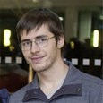
* PhD student at B CUBE - Center for Molecular Bioengineering, Dresden
* Masters in Nanobiophysics, TU Dresden
* BSc in Micro- and Nanosystem Technology, Ural Federal University

I work at the junction of computer science, physics and biology. I am excited about transforming complex real world processes into interactive and easy to understand simulations. I care a lot about conveying information in an accessible to wide audience way.

CV : [CV](docs/resume_cv.pdf)

### Publications
---
#### Quantification of sheet nacre morphogenesis using X-ray nanotomography and deep learning
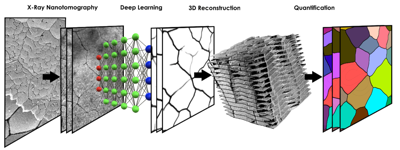</img>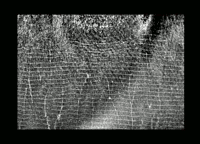</img>
https://doi.org/10.1016/j.jsb.2019.107432

Filtered tomograms using Deep Learning algorithm, performed 3D visualizations, statistical analysis of morphology and fitting to physical laws.

#### Dynamics of Topological Defects and Structural Synchronization in a Forming Nacre

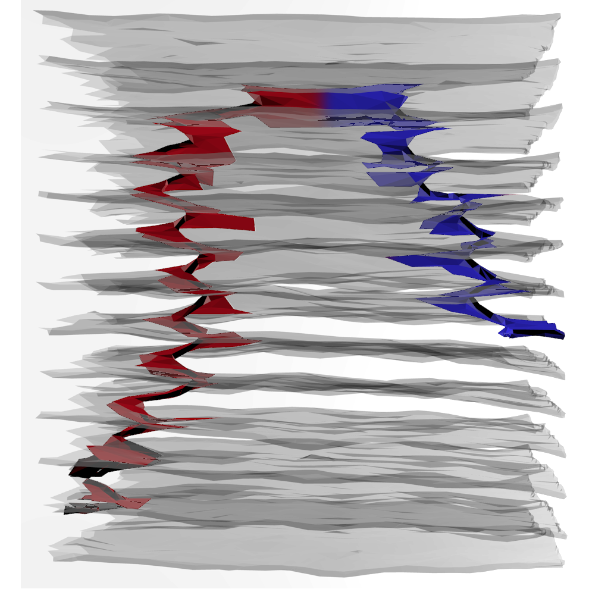</img></img>
*in review as of June, 2020*

Segmented layers from raw data using combination of deep learning, filters and morphological operations. Segmented topological defects in 3D using Modo and Blender. Modeled and simulated their behaviour starting from experimental intial conditions using complex system model.

### Other projects
---
#### Tomography, 3D visualization and 3D analysis
Used FIB-SEM and EDX to analyze chemcal composition of the interface between tissue of mollusk and its shell.
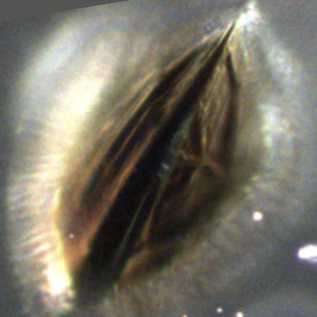</img>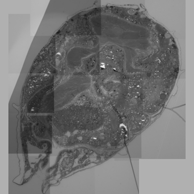</img>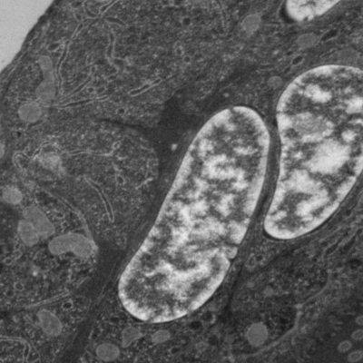</img>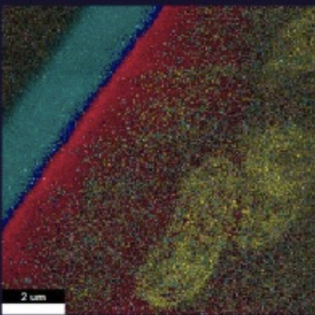</img>

Used FIB-SEM to acquire a tomogram of diatom. Used naive biase ML-technique to segment it. Visualized in 3D using Blender.
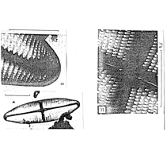</img>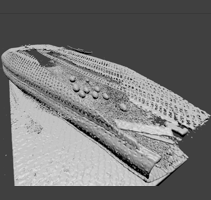</img>

Wrote a script to analyze X-ray data of spicules of sponges. The script automatically computes a number of spikes using clustering algorithm and visualizes each step to monitor its performance.
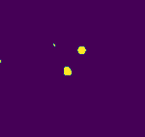</img>

Currently work on segmentation and tracking of topological defects in cuticules of spiders and crabs.

#### 3D analysis
Modeled motion and bending of pili in N. gonorrhea bacteria. Scripted 3Ds Max to visualize results of simulation.
</img>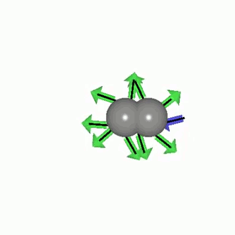</img>
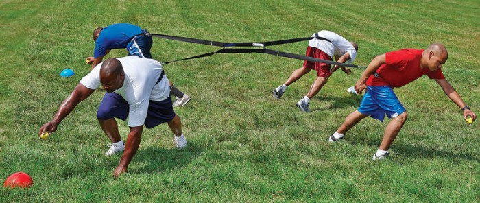</img>

#### Interactive data exploration and simulations
Used Unity platform to create VR-compatible data exploration enviroment. Modified FPScontroller allows to explore data in fly mode. Scales/density can be modified with a slider. Data can be rotated using keybindings.
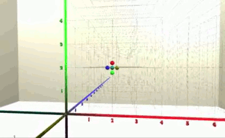</img>

Used D3.js, Observable...
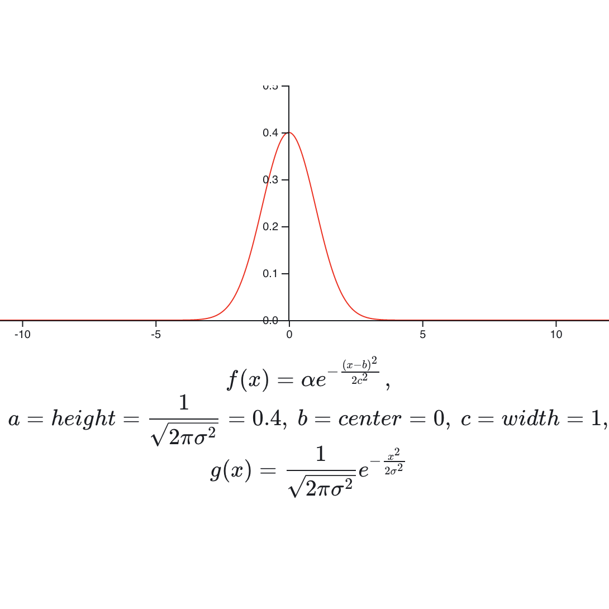</img>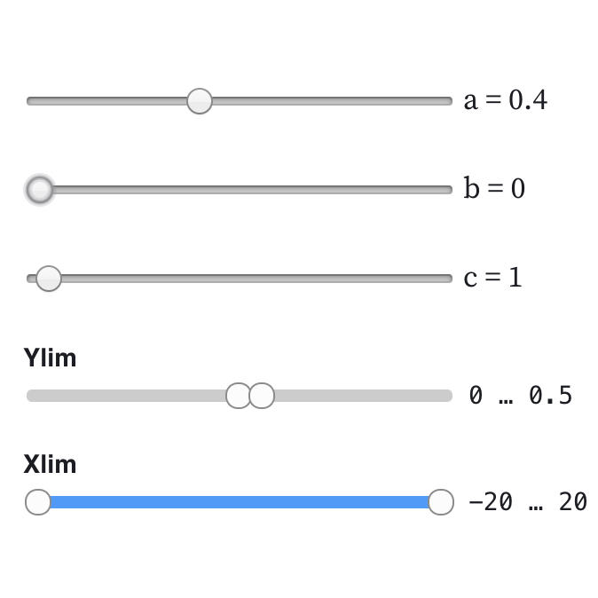</img>

...and Three.js...
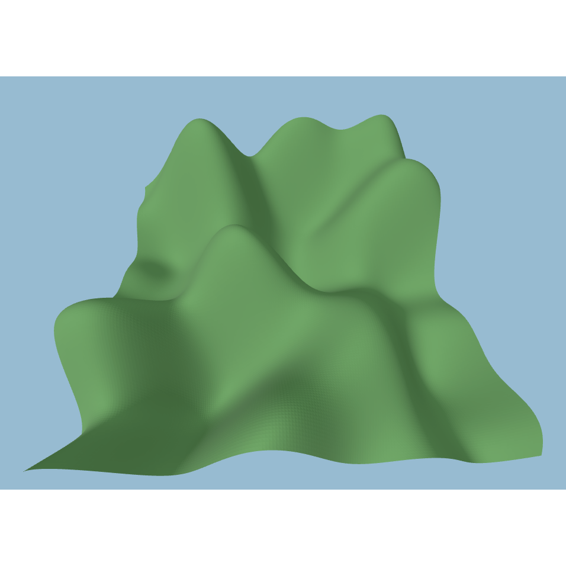</img>

...for various interactive plots and simulations.

#### Image analysis
Scripted ImageJ for many image processing and analysis tasks, such as automatic blob detection.
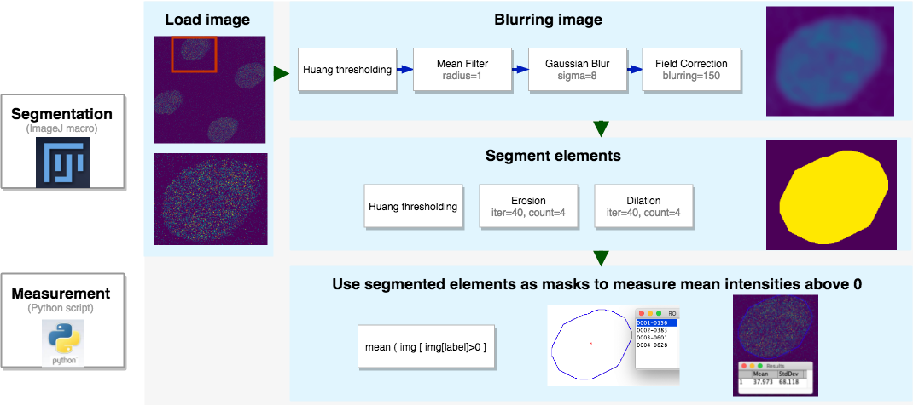</img>

#### Reinforcement Learning
Explored OpenAI binding to Unity through ml-agents toolkit. Used Q-Learnhing reinforcement learning algorithm written in Tensorflow to teach pendulum to balance and half-cheetah to run.
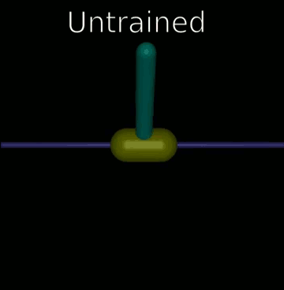</img>

### Small things
---
* Used Python to script and analyze a great variety of things.
* Did some simulations in C++ and Julia.
* Used Bash to perform automatic control of synchrotron-based X-ray setup and to submit jobs to supercomputer cluster.
* Read Matlab and Haskell.
* Used GIMP, VLC, Adobe Photoshop and Inkscape for many-many small tasks.
* Administered RHEL, Ubuntu, Windows, MacOS. Updated kernels, drivers, packages. Resolved dependencies.
* Studied psychological biases.

#### Contact
---
Email: username -at- domain.com (where username = beliaev.maksim, domain = protonmail)
